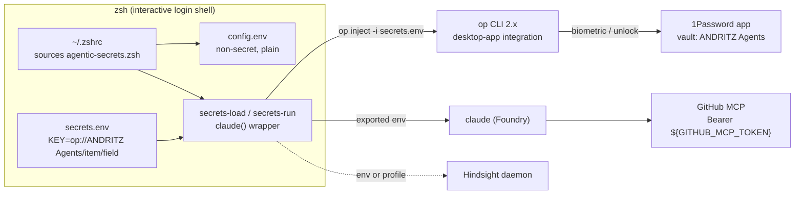

# 1Password Integration for Agentic Secrets — Plan

**Status:** Working on the first host (macOS) as of 2026-09-07. Phases 0 to 2 are done and verified
for the Foundry key: the key was rotated into 1Password, the previously exposed plaintext key is
invalid (verified: HTTP 401), loader installed, legacy plaintext files removed, Claude Code and the
Hindsight daemon restarted on the 1Password-loaded key and verified end to end. GitHub PAT migration
deferred by decision (2026-09-07). See [Execution log](#11-execution-log).

**Host assumptions:** Written from an inventory of a macOS host (Apple Silicon, zsh, oh-my-zsh
with Powerlevel10k, 1Password desktop app + CLI 2.39). The design is OS-agnostic; WSL2 notes are
in [Team notes](#team-notes-macos--wsl2).

## 1. Decision in one paragraph

Keep non-secret configuration in a plain file that every shell sources. Keep secrets in one
dedicated 1Password vault and describe them in a second file that holds only `op://` references.
Resolve the references with a single `op inject` call the first time an agent CLI is started in a
shell (lazy, default), or at interactive shell start (eager, opt-in), or per process with
`op run` (isolated). No secret is written to disk anymore; one biometric prompt per terminal
session instead of plaintext at rest.

## 2. Current state (host inventory, 2026-09-07)

### Secrets that move to 1Password

| # | Secret | Today | Consumers | Notes |
|---|--------|-------|-----------|-------|
| 1 | Microsoft Foundry resource key (resource `<foundry-resource>`) | Plaintext in `~/.config/env/anthropic_foundry.env` as `ANTHROPIC_FOUNDRY_API_KEY`; the **same value** again in `~/.config/env/openai_foundry.env` as `AZURE_OPENAI_API_KEY`; very likely again in `~/.hindsight/profiles/claude-code.env` as `HINDSIGHT_API_LLM_API_KEY` | Claude Code (Foundry), Azure OpenAI SDK/tools, Hindsight daemon | Three copies of one key. Both env files are sourced at shell start; the Anthropic one twice (`.zprofile` and `.zshrc`). |
| 1b | Same Foundry key, further copies found by a full-text scan | `~/.codex/auth.json` (`OPENAI_API_KEY`), a stale `~/.codex/config.toml.save`, and three Claude Code session transcripts under `~/.claude/projects/` | Codex CLI (reads `env_key = "AZURE_OPENAI_API_KEY"` from `config.toml`, so the env variable covers it) | Copies become harmless once key1 is invalidated; delete the stale `.save` file anyway. |
| 2 | GitHub fine-grained PAT | Literal `Authorization: Bearer github_pat_…` header in `~/.claude.json`, once in the user-scope `mcpServers.github` entry and once in the `/Users/<user>` project-scope entry | GitHub MCP server (`https://api.githubcopilot.com/mcp`) | Claude Code expands `${VAR}` in MCP `headers`, so the literal can become `Bearer ${GITHUB_MCP_TOKEN}`. |

### Secrets that stay where they are (already handled well)

| Credential | Mechanism | Verdict |
|------------|-----------|---------|
| `gh` token | macOS keyring (`gh auth status` shows `keyring`) | Keep. |
| Azure CLI tokens | MSAL token cache under `~/.azure` | Keep. Standard behavior. |
| SSH keys | 1Password SSH agent (`IdentityAgent` in `~/.ssh/config`) | Keep. Already 1Password. |
| npm | `~/.npmrc` has no token | Nothing to do. |
| Orca, Codex, Cursor, opencode, Hermes | No API keys found in their config dirs | Nothing to do. |

### Non-secret configuration that stays plain

`CLAUDE_CODE_USE_FOUNDRY`, `ANTHROPIC_FOUNDRY_RESOURCE`, `ANTHROPIC_DEFAULT_*_MODEL`,
`ENABLE_PROMPT_CACHING_1H`, `HINDSIGHT_LLM_PROVIDER`. These move from the two legacy env files
into `~/.config/agentic/config.env` (the installer migrates them).

### Facts that shaped the design

- 1Password CLI 2.39 is installed via Homebrew, the desktop app is running, and the app
  integration is active (`op account list` shows the account although the CLI has never signed
  in on its own). SSH already goes through the 1Password agent. No `op` shell plugins, no
  direnv, no envchain.
- Claude Code sessions started from Orca run in an **interactive login zsh** (`-/bin/zsh -l`
  → `claude`), so functions defined in `~/.zshrc` apply to those sessions. This is what makes the
  lazy wrapper sufficient for the main use case.
- Powerlevel10k instant prompt is enabled. Anything at shell start that prints or prompts must
  stay silent; the loader redirects `op` errors and never blocks in eager mode on failure.
- oh-my-zsh (with the `dotenv` plugin, which auto-sources `.env` files from the current
  directory) only loads when `TERM_PROGRAM=iTerm.app`. Consider dropping `dotenv`; it is a
  classic vector for accidental secret sprawl and prompt injection into agent sessions.
- Claude Code on Foundry supports three auth methods: `ANTHROPIC_FOUNDRY_API_KEY`, Microsoft
  Entra ID via the Azure default credential chain (used automatically when no key or token is
  set), and `ANTHROPIC_FOUNDRY_AUTH_TOKEN` (bearer). Entra ID is the long-term way to remove
  secret #1 for Claude Code entirely; see [Alternatives](#8-alternatives-considered).

## 3. Target design



### Files on the host (`~/.config/agentic/`, mode 700)

| File | Content | Source of truth |
|------|---------|-----------------|
| `config.env` | Non-secret exports, sourced at every shell start | Copy of [`templates/config.env`](templates/config.env), edited locally (resource name) |
| `secrets.env` | `KEY="op://ANDRITZ Agents/<item>/<field>"` lines, no secret material, mode 600 | Copy of [`templates/secrets.env`](templates/secrets.env) |
| `agentic-secrets.zsh` | Loader functions and wrappers | Symlink to [`zsh/agentic-secrets.zsh`](zsh/agentic-secrets.zsh) in this repo |

`~/.zshrc` gets exactly one added line that sources the loader. The two legacy env files and the
two legacy `source` lines are removed in the cut-over.

### Modes

| Mode | Trigger | Where the secret lives | Prompts | Use when |
|------|---------|------------------------|---------|----------|
| **Lazy** (default) | First `claude` (or other wrapped command) in a shell | Exported into that shell after first use | One `op` call per shell that actually starts an agent | Day-to-day work. Shells that never start an agent never touch 1Password. |
| **Eager** | `AGENTIC_SECRETS_AUTOLOAD=1` in `config.env` | Exported into every interactive shell | One `op` call per interactive shell start | Tools that read the key but are not wrapped (scripts, IDE terminals that exec binaries directly). |
| **Isolated** | `secrets-run <cmd>` | Only in the child process (`op run --env-file … --no-masking`) | One `op` call per invocation | Strict isolation; one-off scripts; sharing a screen. |
| **Ad hoc** | `op read "op://ANDRITZ Agents/<item>/<field>"` | stdout only | One call | Debugging, pasting into a tool that has no env support. |

Guards built into the loader: skipped when `op` is missing, when the secrets file is missing,
and inside Claude Code's own Bash tool (`CLAUDECODE` is set there and the environment is already
inherited). Eager mode runs only in interactive shells and never fails the shell start.

## 4. 1Password layout

| Element | Value | Why |
|---------|-------|-----|
| Vault | `ANDRITZ Agents` (existing) | Already the dedicated vault for agent credentials in this account; shareable with team members or a service account later. |
| Item `Foundry AI ECMClaudeCodeBernd` (category Login, existing) | field `password` = Foundry resource key; extra fields already present: `openai endpoint`, `anthropic endpoint`, `model names`, `Resource name` | Backs `ANTHROPIC_FOUNDRY_API_KEY`, `AZURE_OPENAI_API_KEY`, `HINDSIGHT_API_LLM_API_KEY`. Whatever API key a config file needs for this resource is this one field. |
| Item `github-pat-claude-mcp` (API Credential, to be created) | field `credential` = fine-grained PAT | Backs `GITHUB_MCP_TOKEN` |

Reference form: `"op://ANDRITZ Agents/Foundry AI ECMClaudeCodeBernd/password"`.

Rules learned while executing:

- Spaces in vault and item names work in `op inject`, `op run --env-file`, and `op read`
  (verified with all three). Quote the value in the env file; the loader strips one pair of quotes.
- **Never write a reference inside a comment.** `op inject` is a template processor, not a dotenv
  parser: it resolves every `op://` occurrence in the file, comments included, and fails the whole
  file if one cannot be resolved. Describe the item in words instead.
- One item per real secret; several variables may point to the same field.
- Team members keep the same vault name and use their own item in their own account.

## 5. Phases

### Phase 0 — Prepare 1Password (about 10 minutes, manual)

1. In the 1Password app: use vault `ANDRITZ Agents` (create it if it does not exist yet) and make
   sure the two items from [section 4](#4-1password-layout) hold the current values. Do the
   cut-over with the existing values first, rotate afterwards (Phase 2), so a failed rotation
   cannot be confused with a failed integration.
2. Confirm the CLI integration: 1Password > Settings > Developer > *Integrate with 1Password CLI*
   (and Touch ID under Security). Then, in a terminal:

   ```zsh
   op read 'op://ANDRITZ Agents/Foundry AI ECMClaudeCodeBernd/password' | wc -c
   op read 'op://ANDRITZ Agents/github-pat-claude-mcp/credential' | wc -c
   ```

   Expect the character counts (84 and 93 for the current values), one biometric prompt, no
   error. Note how often the app re-prompts in a second tab; that is the prompt cadence users
   will see in eager mode.

### Phase 1 — Install the loader (about 15 minutes)

```zsh
bash secrets-management/1password/install.sh
```

The installer links the loader, copies both templates to `~/.config/agentic/`, migrates the
non-secret lines from the legacy env files into `config.env`, appends one `source` line to
`~/.zshrc` (backup kept), and prints what still needs a manual decision. Then:

```zsh
exec zsh                 # new shell; legacy env files are still sourced at this point
secrets-status           # all four variables "set" (from legacy) — proves nothing yet
secrets-unload && secrets-status   # all "unset"
secrets-load && secrets-status     # all "set" again, this time from 1Password
```

Start Claude Code and run `/status`; the API provider line must show `Microsoft Foundry`.
Run `claude mcp list`; the GitHub server must still be connected.

### Phase 2 — Cut over and rotate (about 20 minutes)

1. Remove the legacy plaintext files and their `source` lines:

   ```zsh
   sed -i.bak '/config\/env\/anthropic_foundry.env/d; /config\/env\/openai_foundry.env/d' ~/.zshrc ~/.zprofile
   rm ~/.config/env/anthropic_foundry.env ~/.config/env/openai_foundry.env
   ```

2. GitHub MCP: replace the literal token with an env reference. Use single quotes so the shell
   does not expand `${GITHUB_MCP_TOKEN}` when the entry is written:

   ```zsh
   claude mcp remove github -s user
   claude mcp add --transport http -s user github https://api.githubcopilot.com/mcp \
     --header 'Authorization: Bearer ${GITHUB_MCP_TOKEN}'
   ```

   Repeat for the project-scope entry under `/Users/<user>` (`-s local` from that directory),
   or delete that duplicate. Check with `claude mcp list` from a shell where `secrets-load` ran;
   a missing-variable warning there means the variable was not loaded in that shell.

3. Hindsight: check whether `HINDSIGHT_API_LLM_API_KEY` is still needed at all with
   `HINDSIGHT_LLM_PROVIDER=claude-code`. If it is, remove the literal from
   `~/.hindsight/profiles/claude-code.env` and let the daemon take it from the process
   environment (start the daemon from a shell where secrets are loaded), or write the profile
   at daemon start with `op inject -i profile.tpl -o ~/.hindsight/profiles/claude-code.env`.
   Verify the precedence (process env vs. profile file) before relying on it.

4. **Rotate both secrets.** Foundry resources have two keys: switch the 1Password item to the
   key that is not in use, run `secrets-load -f`, verify Claude Code, then regenerate the exposed
   key. (Generic procedure; what happened on the first host is in the Execution log.)
   Create a new fine-grained PAT, update the item, delete the old PAT. Rotation is mandatory
   here, not optional: both values sat in plaintext files, and during this inventory the
   Foundry key was echoed once into a Claude Code tool result (session transcript on this host).

5. Open a fresh terminal and confirm `env | grep -c FOUNDRY_API_KEY` prints `0` until `claude`
   is started (lazy) or `1` immediately (eager).

### Phase 3 — Hardening and team roll-out (optional, incremental)

- Enable `AGENTIC_SECRETS_AUTOLOAD=1` only if an unwrapped consumer needs the key at shell start;
  otherwise stay lazy.
- Drop the oh-my-zsh `dotenv` plugin.
- Evaluate Entra ID auth for Claude Code on Foundry (removes secret #1 for that consumer, see
  Alternatives). Requires the `Cognitive Services User` or `Azure AI User` role on the Foundry
  resource for the signed-in identity and a working `az login` with that identity.
- Evaluate OAuth for the GitHub MCP server (`/mcp` inside Claude Code) instead of a PAT.
- Publish the WSL2 steps below to the team; the loader and templates are the same.

## 6. Verification checklist

- [x] `op read` of the Foundry reference works with one biometric prompt (Phase 0). PAT item: pending.
- [x] New shell starts without visible delay or Powerlevel10k instant-prompt warnings.
- [x] `secrets-status` shows all managed variables `unset` in a fresh shell (lazy mode).
- [x] `claude` starts, `/status` shows `Microsoft Foundry`, and afterwards `secrets-status` shows `set`.
- [ ] `claude mcp list` shows the GitHub server connected and no missing-variable warning.
- [ ] `secrets-run env | grep -c FOUNDRY_API_KEY` prints `1`; `env | grep -c FOUNDRY_API_KEY` in the same shell prints `0` (before any `secrets-load`).
- [x] Inside a Claude Code session, the Bash tool sees the variables (inherited) and does not trigger a new prompt.
- [x] `grep -rl 'ANTHROPIC_FOUNDRY_API_KEY=' ~/.config ~/.zshrc ~/.zprofile ~/.hindsight` returns only `secrets.env` (an `op://` reference).
- [ ] Both secrets rotated; old values invalid. (Foundry: done, the old key answers HTTP 401. PAT: pending.)

## 7. Security notes and trade-offs

- **Lazy mode still exports into the shell.** After the first `claude`, every process started
  from that shell inherits the key, exactly like today, but only in shells that started an agent.
  `secrets-run` is the strict alternative.
- **Nothing secret at rest.** The reference file is shareable. The only plaintext copies after
  Phase 2 are process environments and the Claude Code shell snapshots under
  `~/.claude/shell-snapshots/` (they capture functions, not variable values).
- **Prompt cadence** is governed by the 1Password app and cannot be tuned. Verified 2026-09-07
  against the app-integration security docs and on the first host: one authorization per terminal
  session (macOS/Linux: keyed on the TTY plus the session start time), valid for 10 minutes of
  inactivity and refreshed on every `op` call, hard limit 12 hours, revoked when the app locks.
  No app setting auto-approves CLI requests or lengthens the window; only auto-lock (240 min on
  the first host) has an effect. Consequence for agents: Claude Code's Bash tool runs each
  command in a fresh shell without a TTY, so every `op` call inside a session prompts again
  (measured: Touch ID in shell A, `account is not signed in` in the next shell). Never call `op`
  from inside an agent session; the lazy wrapper resolves once in the terminal and the session
  inherits the variables. Eager mode multiplies visible prompts when many panes open at once
  (Orca, tmux); lazy mode does not.
- **Non-interactive contexts** (launchd, cron, CI) cannot use the app integration. Use a
  1Password Service Account (`OP_SERVICE_ACCOUNT_TOKEN`) scoped to the `ANDRITZ Agents` vault for those,
  and store that token in the OS keychain. Out of scope for this plan.
- **Failure mode is loud but not fatal.** If 1Password is locked or the reference is wrong,
  `secrets-load` prints one line to stderr and the wrapped command starts without the secret;
  Claude Code then reports the Foundry credential-chain error, which points straight at the cause.
- **`op run` and TTYs.** `op run` masks secrets by piping the child's output, which breaks
  full-screen TUIs. `secrets-run` therefore passes `--no-masking`; the trade-off is that a leaked
  value in output is not redacted.

## 8. Alternatives considered

| Option | Verdict |
|--------|---------|
| **Entra ID for Claude Code on Foundry** (no key at all; Azure default credential chain, `az login`) | Best long-term for consumer #1, but depends on RBAC on the Foundry resource, on `az` being signed in with the right identity (the host currently uses a different, administrative identity in `az`), and on token lifetime under conditional access. Keep as Phase 3; the 1Password path works today and also covers the OpenAI SDK and Hindsight consumers. |
| **`op run` in front of every command** (isolated only) | Cleanest isolation, but one `op` call per launch, TTY/masking caveat, and it does not help unwrapped consumers. Offered as `secrets-run`, not as default. |
| **Claude Code `apiKeyHelper`** | Only feeds the Anthropic API key / auth token path, not `ANTHROPIC_FOUNDRY_API_KEY`; also Claude-only. Not used. |
| **direnv / envchain / macOS Keychain cache** | Extra tool or a second secret store to manage; keychain caching reintroduces at-rest copies. Not used. |
| **1Password shell plugins** (`op plugin init gh`, `claude`) | Good for CLIs that read one credential (gh, aws). Here `gh` already uses the keyring and Claude Code needs several variables plus Foundry-specific ones. Not used for now. |
| **Eager mode as default** | Simplest mental model, but prompts and `op` latency on every shell in a multiplexer-heavy setup. Opt-in only. |
| **Service Account token on the workstation** (`OP_SERVICE_ACCOUNT_TOKEN`, prompt-free) | Removes every prompt, but the token is a bearer secret at rest (Keychain at best) with standing read access to the vault, which is exactly what the biometric integration was chosen to avoid. Reserve for launchd/CI. If ever used interactively, scope it to a dedicated vault holding only the agent items. |
| **Manual sign-in session** (`eval "$(op signin)"` with the app integration off) | Session token in the environment: 30 minutes idle, inherited by child processes, shareable across panes. But account password instead of Touch ID, and the app integration must be turned off. Not better than lazy mode. |

## 9. Team notes (macOS + WSL2)

- **macOS:** `brew install 1password-cli`; 1Password app > Settings > Developer > *Integrate with
  1Password CLI*; Touch ID under Security. Then `install.sh`.
- **Windows + WSL2:** install 1Password for Windows and enable the CLI integration there. Inside
  WSL, either install `op` for Linux and follow 1Password's WSL guide (the Linux CLI talks to the
  Windows app), or alias `op` to `op.exe` from the Windows install. The zsh loader is unchanged.
  Paths in `config.env` are per user; no host paths are hard-coded.
- **bash users:** `secrets-load`/`secrets-run` port to bash with minor edits (`${(f)…}` and
  `${(P)k}` are zsh-only). Not done yet; open item.
- **Team members without a 1Password account of their own:** the reference file still applies once
  the `ANDRITZ Agents` vault is shared with them from a business account, or they use a Service Account.

## 10. Open items

- Confirm `op inject` resolves bare `op://` references in a dotenv file identically to `op run --env-file` (both documented; verified in Phase 0/1).
- Resolved 2026-09-07: with `HINDSIGHT_API_LLM_PROVIDER=claude-code` the Hindsight daemon does not use
  `HINDSIGHT_API_LLM_API_KEY`; it calls the LLM through the Claude Agent SDK, which picks up the Claude
  Code Foundry variables from the shell. The line in `secrets.env` only matters for other providers.
- Decide on Entra ID for Foundry and OAuth for the GitHub MCP server (Phase 3).
- bash port of the loader for WSL2 users who do not run zsh.

## 11. Execution log

**2026-09-07, first host (macOS, Apple Silicon, zsh):**

- Inventory confirmed all three plaintext copies (two env files, Hindsight profile) and the running
  session hold the same value, which is Foundry **key1**. A full-text scan also found the key in
  Codex's `auth.json`, a stale `config.toml.save`, and three Claude Code transcripts.
- The 1Password item `Foundry AI ECMClaudeCodeBernd` in vault `ANDRITZ Agents` already existed
  and held key1.
- **key2 regenerated** with `az cognitiveservices account keys regenerate --key-name key2`, written
  straight into the item's `password` field (no value printed), hash-verified against Azure, and
  tested end-to-end with a `claude-haiku-4-5` request against the Foundry Anthropic endpoint
  (HTTP 200; the endpoint takes the key in the `x-api-key` header). *Correction, later that day:*
  Azure reports the value stored in the item as **key1**, and the exposed plaintext key answers
  HTTP 401, so the rotation is complete either way; see the second entry below.
- `install.sh` run; `~/.config/agentic/config.env` set to the real resource name with lazy wrappers
  `AGENTIC_WRAP_COMMANDS="claude codex"`; `secrets.env` points all three variables at the item.
- Two loader bugs found in the real login shell and fixed: quoted references kept their quotes
  (86 instead of 84 characters), and a reference fragment in a comment made `op inject` fail.
- Legacy `source` lines removed from `~/.zshrc` and `~/.zprofile` (backups kept), both env files
  under `~/.config/env/` deleted, literal key removed from `~/.hindsight/profiles/claude-code.env`.
- Verified in a fresh login shell: no Foundry key in the environment at startup; the first wrapped
  command loads key2 from 1Password.
- Codex verified: with `~/.codex/auth.json` removed, `codex exec` answered a test prompt using
  `AZURE_OPENAI_API_KEY` loaded by the wrapper, and did not recreate the file. The old key was
  redacted in the kept `auth.json.bak-*` and in the stale `config.toml.save`.

**2026-09-07, later the same day (same host):**

- Claude Code and the Hindsight daemon restarted after the cut-over; both now run with the key the
  wrapper loads from 1Password (key2). Confirmed from inside a restarted Claude Code session: the
  Bash tool inherits the variables, no extra 1Password prompt.
- Whole flow confirmed working by the owner in day-to-day use. Repo state committed on branch
  `feature/1pw-integration`.
- `grep -rl 'ANTHROPIC_FOUNDRY_API_KEY='` over `~/.config`, `~/.zshrc`, `~/.zprofile`, `~/.hindsight`
  returns only `~/.config/agentic/secrets.env`. `~/.codex/auth.json` was not recreated.
- Still literal: the GitHub PAT, twice in `~/.claude.json` (user scope and the `/Users/<user>`
  project scope).

**2026-09-07, prompt cadence check (same host):**

- Question: can CLI access be auto-approved instead of Touch ID on every read? Answer: no. The app
  integration has no auto-approve setting; the authorization window (10 min idle, 12 h max, per
  terminal session) is fixed. Measured inside Claude Code's Bash tool: `op signin` in one shell
  prompted once (3.2 s), follow-up `op` calls in the same shell ran without a prompt (0.1 to 1.3 s),
  the next Bash tool call (new shell, no TTY) reported `account is not signed in`. In a normal
  terminal tab the authorization is shared for the whole tab. Recorded in sections 7 and 8.
- Decision (owner): keep the setup as is, no Service Account on the workstation. Wait for official
  1Password support for agent workflows and terminal multiplexers (community request CFP-19201).
- **Key audit** (SHA-256 prefixes compared, no value printed): the 1Password item holds the value
  Azure reports as **key1**; this Claude Code session and the Hindsight daemon run on it (live
  request: HTTP 200). The previously exposed plaintext key, still present in older Claude Code
  transcripts, matches neither current key and answers HTTP 401. key2 (regenerated the same
  afternoon) is an unused spare that was never written anywhere. Neither current key appears in any
  transcript. Conclusion: rotation complete. **Do not regenerate key1; it is the live key.**
- **Hindsight verified end to end:** daemon healthy on port 9077 (`/health`), its log shows
  `Claude Code connection verified successfully` right after the restart, a live
  `memories/dry-run-extract` call through the daemon returned HTTP 200 with one extracted fact (an
  LLM round trip via the Claude Agent SDK), the MCP server `plugin:hindsight-memory:hindsight`
  connects. The daemon inherits the Foundry variables from the wrapper-loaded shell; it does not
  use `HINDSIGHT_API_LLM_API_KEY` with provider `claude-code`.
- **Loader bug found from inside Claude Code:** its shell snapshot omits functions whose names start
  with `_`, so `claude mcp list` in the Bash tool failed with `command not found: _agentic_wrap`.
  Fixed: wrappers are self-contained, the helper is now `secrets-names`. Rule for this file: no
  underscore-prefixed function names.
- Hindsight MCP cold start (not a secrets issue): after a reboot the plugin starts the daemon with
  `uvx hindsight-embed@latest`; first readiness took about 105 s, longer than Claude Code's 30 s MCP
  connect timeout, so the first session after a cold start reports the Hindsight MCP as timed out.
  Later sessions connect immediately.

**Still open after this run:**

1. Foundry keys: nothing. key1 is live in 1Password, key2 is an unused spare.
2. GitHub PAT: **deferred by decision on 2026-09-07.** It stays as a literal header in
   `~/.claude.json` for now. When picked up: create item `github-pat-claude-mcp`, add the
   `GITHUB_MCP_TOKEN` line, rewrite the MCP header (Phase 2, step 2), rotate the PAT.
